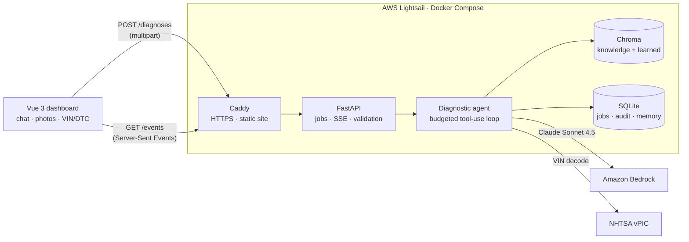

# AutoDiagnose AI

**An agentic diagnostic copilot for automotive workshop technicians.** A technician describes the symptoms and can add the VIN, OBD-II fault codes and inspection photos. AutoDiagnose AI then:
- searches a workshop knowledge base,
- reasons over the evidence with Claude on Amazon Bedrock,
- streams each step live, and
- returns ranked causes with cited sources, confirmation tests and a parts-and-labour estimate.

Safety-critical repairs are held for senior sign-off. Every confirmed fix becomes knowledge the next diagnosis can use.

Built for the NUS-ISS *Show Me Your Agents* 2026 hackathon — problem statement: **Vehicle Fault Diagnosis**.

---

## Contents

- [The problem](#the-problem)
- [What AutoDiagnose AI does](#what-autodiagnose-ai-does)
- [Architecture](#architecture)
- [How a diagnosis works](#how-a-diagnosis-works)
- [Safety and responsible AI](#safety-and-responsible-ai)
- [Tech stack](#tech-stack)
- [Getting started](#getting-started)
- [Configuration](#configuration)
- [Testing](#testing)
- [Deployment](#deployment)
- [API reference](#api-reference)
- [Project structure](#project-structure)
- [Roadmap](#roadmap)
- [Dataset and licence](#dataset-and-licence)

---

## The problem

Workshops depend on experienced technicians to turn a customer's description, inspection findings, past repairs and manufacturer guidance into a diagnosis. Two problems follow:
- Less experienced technicians need guidance, which ties up senior staff.
- Uncommon faults add hours to repair turnaround.

When a senior technician leaves, their knowledge leaves with them.

## What AutoDiagnose AI does

| Capability | Details |
|---|---|
| **Multimodal intake** | Symptom text, VIN or chassis number, OBD-II fault codes and up to 4 photos in one chat. Photos are resized and stripped of EXIF/GPS data in the browser. |
| **Grounded answers** | Semantic retrieval over the Zenodo Automotive Faults Dataset and its diagnostic flowcharts. Every cause cites the knowledge entries it rests on, and invented citations are dropped. |
| **Transparent reasoning** | A live, typed trace of each step: VIN decode, photo analysis, service history, knowledge search. It shows evidence and a confidence meter, not raw model output. |
| **Actionable output** | Ranked causes with confidence, ordered confirmation tests, an indicative parts and labour estimate in SGD, and safety flags. |
| **Conversation memory** | Follow-up questions keep the chat's context. A photo uploaded earlier is reused in later turns without re-uploading. |
| **Human in the loop** | Brake, steering, airbag and EV high-voltage plans stay hidden until a senior technician approves them. Low-confidence answers are framed as "run these tests first". |
| **Learns from the workshop** | Answers outside the dataset are stored as *unverified*. A technician-confirmed fix becomes *trusted* knowledge that future diagnoses cite. |
| **Resilient** | If Bedrock is unreachable or the daily budget is spent, a local fallback answers from the knowledge base alone and the UI says so. Dropped streams resume without re-running the job. |

## Architecture



- **Split write and read.** `POST /diagnoses` validates the input, stores the job and returns `202` with a `job_id` immediately. The agent runs as a background task. `GET /diagnoses/{id}/events` streams typed events with a 15 s heartbeat. Reconnects resume from `Last-Event-ID`, so a dropped connection never re-runs, or re-bills, a diagnosis.
- **Budgeted agent loop.** Up to 3 reasoning turns, about 6 tool calls and a 45 s wall-clock budget. On the last turn Claude is required to call `submit_diagnosis`, whose JSON schema matches the API contract, so the output is always structured.
- **Knowledge base.** Chroma with a local ONNX embedding model (all-MiniLM-L6-v2). Retrieval is free, runs offline and still works when the cloud model is unavailable.

## How a diagnosis works

1. **Vehicle context.** The VIN is decoded through NHTSA vPIC. Non-17-character chassis numbers fall back to manual make and model.
2. **Photos.** Claude vision records visible components, abnormalities and warning lights. The findings are saved to the chat and reused by follow-up questions.
3. **Service history.** Earlier confirmed fixes for the same VIN are retrieved from SQLite.
4. **Retrieval.** One query combines the symptoms, the fault codes translated into words (e.g. `P0301` → "cylinder 1 misfire"), the photo findings and the previous turn. When a flowchart step matches, the rest of its decision path is pulled in as well.
5. **Reasoning.** Claude receives the evidence with citable IDs, may search again with a sharper query, and submits a structured diagnosis.
6. **Safety and escalation.** The model's safety classification is combined with a server-side keyword guard. Any safety-critical category, or confidence below 0.5, sets `escalation_required`.
7. **Learning.** With no relevant match (cosine similarity below 0.40), the answer is labelled *general knowledge* and saved as unverified. When a technician closes the job, the confirmed cause and fix are written back as trusted knowledge and the unverified entry is retired. A rejected answer is removed.

## Safety and responsible AI

- **Senior sign-off:** safety-critical plans are not rendered until they are approved. Every job ends in an accept or reject decision, and rejecting requires a reason.
- **Prompt-injection guard:** technician text and photo findings are passed to the model as tagged data, and the system prompt forbids following instructions inside them.
- **Grounding:** cited evidence IDs are validated against what was actually retrieved.
- **Privacy:** photos are re-encoded in the browser and again on the server, which removes EXIF and GPS data. Raw photos are not stored; only the text findings are kept.
- **Cost controls:**
  - `max_tokens` is set on every call, and token use and cost are logged per diagnosis.
  - A daily spend cut-off switches to the local fallback once it's reached.
  - New diagnoses are rate-limited per client.
- **Audit trail:** each diagnosis stores its sources, model ID, token counts, cost, latency and the technician's decision.
- **Operations:** secrets live only in `.env`. The container runs as a non-root user, and HTTPS is terminated by Caddy.

## Tech stack

| Layer | Technology |
|---|---|
| Frontend | Vue 3, TypeScript, Vite, Tailwind CSS v4, Pinia |
| API | Python 3.11, FastAPI, Server-Sent Events |
| AI model | Claude Sonnet 4.5 on Amazon Bedrock, via the Anthropic Python SDK (`AnthropicBedrock`) |
| Knowledge base | Chroma (persistent) with the all-MiniLM-L6-v2 ONNX embedding model |
| Storage | SQLite: jobs, diagnoses, approvals, feedback, chat memory, daily usage |
| Vision preprocessing | OpenCV |
| Hosting | AWS Lightsail, Docker Compose, Caddy (automatic HTTPS) |
| Testing | pytest (backend), Vitest (frontend) |

## Getting started

**Prerequisites:** Python 3.11+, Node.js 20+, and AWS credentials with access to Claude Sonnet 4.5 on Bedrock.

```bash
git clone https://github.com/Sakshamgupta90/AutoDiagnoseAI.git
cd AutoDiagnoseAI

# Backend
python3 -m venv .venv
.venv/bin/pip install -r requirements.txt
cp .env.example .env                  # add your AWS credentials
.venv/bin/python -m src.llm.check     # verifies Bedrock access with one small request

# Frontend
cd frontend && npm install && cd ..
```

Run the two services in separate terminals:

```bash
.venv/bin/uvicorn src.main:app --port 8000        # API on http://localhost:8000 (docs at /docs)
```

```bash
cd frontend && npm run dev                        # UI on http://localhost:5173
```

`frontend/.env.local` should point at the local API:

```
VITE_API_BASE_URL=http://localhost:8000/api/v1
VITE_USE_MOCK=false
```

The first start downloads the embedding model (about 80 MB) and loads the dataset into `data/chroma/`. To run without any Bedrock calls, start the API with `LLM_ENABLED=false`, which uses the local knowledge-base fallback. To work on the UI with no backend at all, set `VITE_USE_MOCK=true`.

## Configuration

All settings are read from `.env`; see [`.env.example`](.env.example) for the full list.

| Variable | Default | Purpose |
|---|---|---|
| `AWS_REGION` | `ap-southeast-1` | Bedrock region |
| `AWS_ACCESS_KEY_ID` / `AWS_SECRET_ACCESS_KEY` | — | IAM credentials. Alternatively set `AWS_BEARER_TOKEN_BEDROCK`. |
| `BEDROCK_MODEL_ID` | `global.anthropic.claude-sonnet-4-5-20250929-v1:0` | Claude inference profile |
| `LLM_ENABLED` | `true` | Set to `false` to force the local fallback |
| `DAILY_BUDGET_USD` | `5.0` | Daily Bedrock spend cut-off |
| `MAX_TURNS` / `MAX_TOOL_CALLS` / `JOB_TIME_BUDGET_SECONDS` | `3` / `6` / `45` | Agent budget |
| `CONFIDENCE_THRESHOLD` | `0.5` | Below this, the answer is escalated as low confidence |
| `RELEVANCE_THRESHOLD` | `0.40` | Minimum cosine similarity for a knowledge match to count as grounding |
| `CORS_ORIGINS` | `http://localhost:5173` | Allowed browser origins, comma-separated |
| `RATE_LIMIT_PER_MINUTE` | `12` | New diagnoses per client per minute |
| `DOMAIN` | — | Public hostname for HTTPS in production |

## Testing

```bash
.venv/bin/python -m pytest -q       # 13 tests: agent loop (scripted Claude), retrieval, learning, fallback, full HTTP lifecycle
cd frontend && npm test             # 12 tests: SSE parser, VIN and fault-code validation
```

The backend tests use a scripted stand-in for Claude, so they run without AWS credentials or cost.

## Deployment

Production runs on a single AWS Lightsail instance (Ubuntu 24.04, 2 vCPU / 4 GB) with Docker Compose:

- **`api`:** FastAPI, Chroma and SQLite, with data on a persistent volume.
- **`web`:** Caddy, which serves the built Vue app, proxies `/api` to FastAPI without buffering the event stream, and obtains HTTPS certificates automatically.

```bash
# on the instance, with Docker installed and ports 80/443 open
git clone https://github.com/Sakshamgupta90/AutoDiagnoseAI.git && cd AutoDiagnoseAI
cp .env.example .env        # credentials, plus DOMAIN (e.g. <static-ip-with-dashes>.sslip.io)
docker compose up -d --build
docker compose exec api python -m src.llm.check
```

To update: `git pull && docker compose up -d --build`. To back up the database and knowledge base: `./deploy/backup.sh`. Enable Lightsail automatic snapshots to protect the data volume.

## API reference

All endpoints are under `/api/v1`. Interactive documentation is served at `/docs`.

| Method | Path | Description |
|---|---|---|
| `POST` | `/diagnoses` | Multipart form with `symptom_text`, `vin`, `make`, `model`, `dtc_codes` (repeated), `photos` (repeated) and `session_id`. Returns `202 {job_id, status}`. |
| `GET` | `/diagnoses/{id}/events` | Server-Sent Events: `step`, `evidence`, `confidence`, `escalation`, `notice`, `done` (or `error`). Supports `Last-Event-ID`. |
| `GET` | `/diagnoses/{id}` | Job status and final diagnosis (polling fallback) |
| `POST` | `/diagnoses/{id}/approve` · `/reject` | `{technician_id, notes?}` |
| `POST` | `/diagnoses/{id}/feedback` | `{confirmed_cause, confirmed_fix, part_cost?, labour_hours?}`. Closes the job and adds the fix to the knowledge base. |
| `GET` | `/health` · `/stats` | Service status, knowledge-base size, today's spend, average latency and cost per diagnosis |

## Project structure

```
├── src/
│   ├── main.py                  # FastAPI app, CORS, startup ingestion
│   ├── api/routers/diagnose.py  # REST and SSE endpoints
│   ├── agents/                  # orchestrator (agent loop, safety, fallback, learning) and prompts
│   ├── llm/                     # Bedrock client with budget and usage tracking; connectivity check
│   ├── knowledge/               # Chroma store, dataset ingestion, fault-code decoder
│   ├── services/jobs.py         # per-job event log with replay
│   ├── storage/db.py            # SQLite schema and queries
│   └── tools/                   # VIN decoder, OpenCV image preprocessing
├── frontend/                    # Vue 3 technician dashboard
├── data/zenodo/                 # dataset JSON, flowchart images, transcribed decision trees
├── tests/                       # pytest suite
├── deploy/                      # Caddy config, web image, backup script
├── Dockerfile                   # API image
└── docker-compose.yml           # production stack
```

## Roadmap

- Evaluation harness: top-1/top-3 accuracy against a no-retrieval baseline, p50/p95 latency, and measured cost per diagnosis.
- Technician login and per-workshop data isolation.
- Integration with workshop job-card systems, and OEM service data where licensed.
- A managed vector store and database for multi-site deployments; tracing with CloudWatch.

## Dataset and licence

The knowledge base is built from the **Automotive Faults Dataset** (Zenodo record [15626055](https://zenodo.org/records/15626055)), licensed under [CC BY 4.0](https://creativecommons.org/licenses/by/4.0/). The four flowchart images were transcribed into linked text decision steps in [`data/zenodo/flowcharts.json`](data/zenodo/flowcharts.json).

AI suggestions must be verified by a qualified technician before any repair.

The source code is released under the [MIT License](LICENSE).
